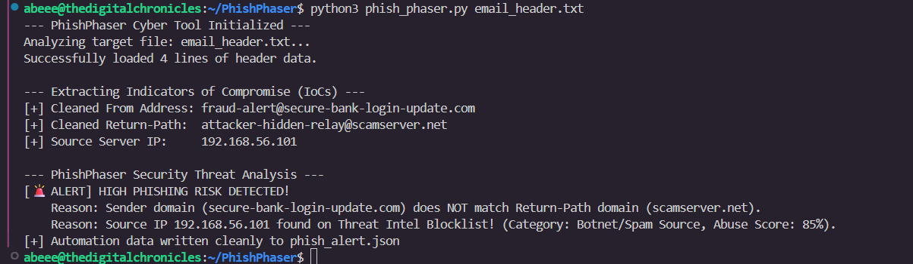
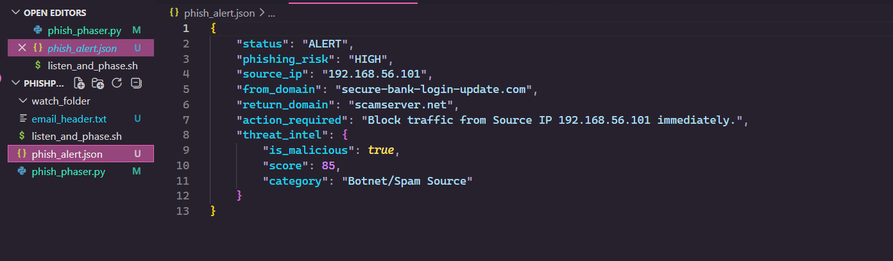

# 🕵️‍♂️ PhishPhaser

A rugged, automated email forensics and incident response pipeline built to ingest raw header files, extract critical Indicators of Compromise (IoCs), and query threat intelligence data on autopilot. No manual file dragging. No human intervention. Just pure infrastructure defense.

---

## 🛠️ The Architecture

PhishPhaser doesn't just parse text; it operates as a live automated security pipeline. The architecture utilizes a two-tier automation structure:

1. **The Watcher Daemon (`listen_and_phase.sh`)**: A persistent background Bash loop that monitors an intake directory (`watch_folder/`) for incoming raw threat vectors. The millisecond a file drops, it passes it to the analytical core and instantly clears the queue.
2. **The Analytical Core (`phish_phaser.py`)**: A Python-driven forensics engine that strips out key email markers, runs domain-alignment verification, queries a threat reputation list, and drops structural data to disk.

---

## 🚀 Capabilities & Features

* **Automated Intake Ingestion**: Zero human dragging-and-dropping. Engineered to process data streams via a localized Linux pipeline.
* **Multi-Vector Threat Analysis**: Evaluates structural tracking fields simultaneously (mismatched `From` vs. `Return-Path` domains).
* **Threat Intelligence Integration**: Features a simulated API reputation checker to flag known malicious source server infrastructure.
* **Persistent Structural Logging**: Outputs fully structured `phish_alert.json` logs, ready to be piped directly into enterprise SIEMs, firewalls, or ticketing systems.

---

## 💻 Technical Blueprint

### Requirements
* Linux environment (Tested on Ubuntu)
* Python 3.x
* Bash shell
---

## 📊 Execution & Verification

Below is the live verification of the PhishPhaser pipeline processing a malicious email vector and generating high-fidelity structural data in real time.

### Pipeline Terminal Execution
The analytical core identifies the domain mismatch, queries the simulated threat database, flags the known malicious infrastructure, and triggers the alert baseline:



### Automated JSON Payload Output
The persistent data payload written cleanly to disk, structured specifically for ingestion by upstream SIEM or automated firewall systems:


### Pipeline Execution
To spin up the background guard dog and start monitoring the perimeter:

```bash
chmod +x listen_and_phase.sh
./listen_and_phase.sh